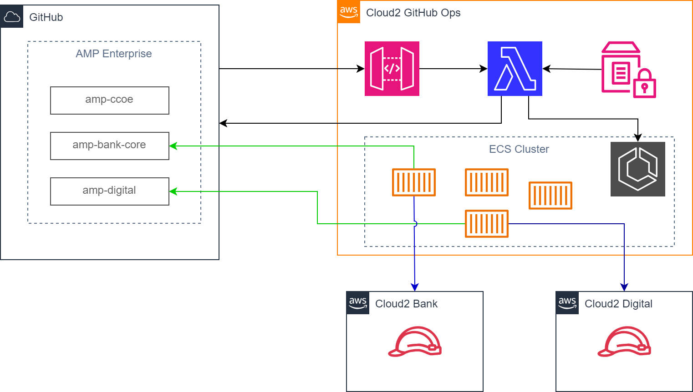

# Terraform module Self-Hosted Ephemeral GitHub Actions runners on AWS ECS Fargate

## Features
- Highly available - Runner is provided whenever a job is ready to execute
- Ephemeral Runner - Ephemeral self-hosted runner provides each job run in a clean environment.
- Auto-scale - A new self-hosted runner is provided whenever a workflow job is started and ready to be executed
- One-time token - Generates and Uses and one time token (JIT) for registering runner
- Isolation between jobs - A runner for a single job and cannot be reused for other jobs
- Least privileges - The runner has the least privileges for the job execution (mainly Infra build in Cloud 2 accounts)
- Minimum management overhead - The new runner solution can be enabled/applied to AMP GitHub tenants (organisations) with minimum management overheads.
- Centralised deployment - All AWS resources are deployed centrally to Platform account only.
- Organizational runner - Deploy the runners per organization and use by the organization only.
- Single GitHub App - Only one github app is created centrally on CCOE organisation. This app needs to be installed into other organisation wants to use the runners
- Single Private key to manage - Only one private key needs to be managed and rotated as required

<picture>
  <source media="(prefers-color-scheme: dark)" srcset="image.png">
  
</picture>

## Getting started
Check out the detailed instructions in the https://teamtools.amp.com.au/confluence/x/kZz7Jw confluence page. On a high level, the following steps are required to get started:

1. Create and configure a GitHub App
2. Create Lambda layer
3. Deploy Infrastructure using terraform
4. Update SSM parameters
5. Add API webhook invoke url in github 

## Configuration
Follow the SSM parameters section in the page https://teamtools.amp.com.au/confluence/x/kZz7Jw

## License
This project is licensed under AMP Services Ltd - Australia

Terraform root module documention

<!-- --8<-- [start:mkdocsrunners] -->

<!-- BEGIN_TF_DOCS -->
## Requirements

| Name | Version |
|------|---------|
|  [terraform](#requirement\_terraform) | >= 1.9.5 |
|  [aws](#requirement\_aws) | ~> 5.2 |

## Providers

| Name | Version |
|------|---------|
|  [aws](#provider\_aws) | 5.65.0 |
|  [archive](#provider\_archive) | 2.5.0 |

## Modules

| Name | Source | Version |
|------|--------|---------|
|  [ecs](#module\_ecs) | ./modules/ecs | n/a |
|  [ssm](#module\_ssm) | ./modules/ssm | n/a |
|  [webhook](#module\_webhook) | ./modules/webhook | n/a |

## Resources

| Name | Type |
|------|------|
| [aws_ecs_cluster.github_actions_cluster](https://registry.terraform.io/providers/hashicorp/aws/latest/docs/resources/ecs_cluster) | resource |
| [aws_ssm_parameter.github_app_[*]](https://registry.terraform.io/providers/hashicorp/aws/latest/docs/resources/ssm_parameter) | resource |
| [aws_api_gateway_rest_api.webhook-api](https://registry.terraform.io/providers/hashicorp/aws/latest/docs/resources/api_gateway_rest_api) | resource |
| [aws_api_gateway_resource.webhook-resource](https://registry.terraform.io/providers/hashicorp/aws/latest/docs/resources/api_gateway_resource) | resource |
| [aws_api_gateway_method.webhook-method](https://registry.terraform.io/providers/hashicorp/aws/latest/docs/resources/api_gateway_method) | resource |
| [aws_api_gateway_integration.webhook-integration](https://registry.terraform.io/providers/hashicorp/aws/latest/docs/resources/api_gateway_integration) | resource |
| [aws_api_gateway_deployment.webhook-deployment](https://registry.terraform.io/providers/hashicorp/aws/latest/docs/resources/api_gateway_deployment) | resource |
| [aws_api_gateway_stage.webhook-stage](https://registry.terraform.io/providers/hashicorp/aws/latest/docs/resources/api_gateway_stage) | resource |
| [aws_lambda_function.runner](https://registry.terraform.io/providers/hashicorp/aws/latest/docs/resources/lambda_function) | resource |
| [aws_subnets.backend_subnets](https://registry.terraform.io/providers/hashicorp/aws/latest/docs/data-sources/subnets) | data resource |
| [aws_vpc.internal_vpc](https://registry.terraform.io/providers/hashicorp/aws/latest/docs/data-sources/vpc) | data resource |

## Inputs

| Name | Description | Type | Default | Required |
|------|-------------|------|---------|:--------:|
|  [prefix](#input\_prefix) | Prefix to add on the resources created. | `string` | `github-actions-ephemeral` | yes |
|  [ssm_param_prefix](#input\_ssm_param_prefix) | Prefix for SSM parameters. | `string` | `ccoe` | yes |
|  [environment](#input\_environment) | Environment where this infrstructure is deployed. | `string` | `dev` | yes |
|  [runner_group_name](#input\_runner_group_name) | Runner group name. | `string` | `Default` | no |
|  [layer_name](#input\_layer_name) | Lambda layer name | `string` | `ghaEphemeralLayer` | yes |
|  [runner_lambda_timeout](#input\_runner_lambda_timeout) | Lambda timeout | `number` | `60` | no |
|  [role_permissions_boundary](#input\_role_permissions_boundary) | Permissions boundary that will be added to the created roles | `string` | `null` | no |
|  [kms_key_arn](#input\_kms_key_arn) | Optional CMK Key ARN to be used for Parameter Store. This key must be in the current account. | `string` | `null` | no |
|  [logging_retention_in_days](#input\_logging_retention_in_days) | Specifies the number of days you want to retain log events for the lambda log group. | `number` | `180` | no |
|  [logging_kms_key_id](#input\_logging_kms_key_id) | Specifies the kms key id to encrypt the logs with. | `string` | `null` | no |
|  [lambda_security_group_ids](#input\_lambda_security_group_ids) | List of security group IDs associated with the Lambda function. | `list(string)` | `[]` | no |
|  [log_level](#input\_log_level) | Logging level for lambda logging. Valid values are  'trace', 'debug', 'info', 'warn', 'error'. | `string` | `info` | no |
|  [lambda_runtime](#input\_lambda_runtime) | AWS Lambda runtime. | `string` | `python3.12` | no |
|  [lambda_architecture](#input\_lambda_architecture) | AWS Lambda architecture. Lambda functions using Graviton processors ('arm64') tend to have better price/performance than 'x86_64' functions. | `string` | `x86_64` | no |
|  [gha_runner_image](#input\_gha\_runner\_image) | Gihtub ECR runner image name. | `string` | `194167259353.dkr.ecr.ap-southeast-2.amazonaws.com/ccoe-ecr-ubuntu-githubactions-ephemeral:latest` | yes |
|  [ecs_cluster](#input\_ecs_cluster) | The name of the ECS cluster. | `string` | `ecs-cluster` | yes |
|  [ecs_container_name](#input\_ecs_container_name) | container name | `string` | `ccoe-ecr-ubuntu-githubactions-ephemeral` | yes |
|  [github\_app](#input\_github\_app) | GitHub app parameters, see your github app. | <pre>object({     private_key     = string     id             = string     webhook_secret = string   })</pre> | n/a | yes |

## Outputs

| Name | Description |
|------|-------------|
|  [api-invocation-url](#output\_webhook) | n/a |
<!-- END_TF_DOCS -->
<!-- --8<-- [end:mkdocsrunners] -->

